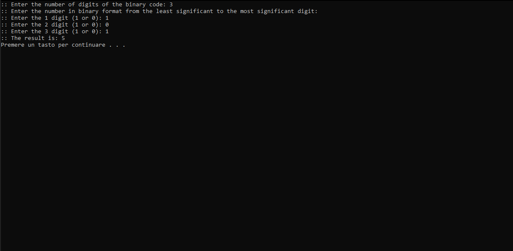

# binary_to_decimal

Converte the binary code to unsigned decimal.

The C code include the <math.h> library.
For compile the file il Linux:

:: $ gcc bin_to_dec.c -lm -o bin_to_dec

For execute in Linux:

:: $ .\bin_to_dec

Output program: 

 
